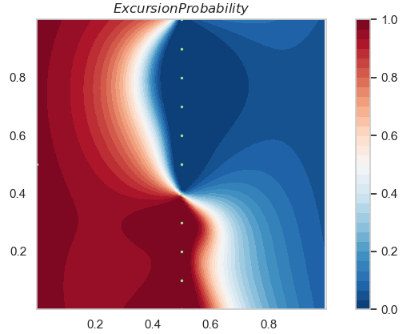

.. Copied from gpytorch.
:github_url: https://github.com/CedricTravelletti/Submarine

MESLAS: Multivariate Excurions Set Learning by Adaptive Sampling
=========================================================================================

The goal of the MESLAS package is to provide functionalities for simulation and
estimation of physical phenomenon using multivariate random fields.

As an example, consider the Temperature and Salinity in the ocean. These two
variables can be modelled as a bivariate Gaussian random field (GRF) with some
correlation between the outputs.
One can the draw realizations of the GRF to get plausible spatial distributions
of oceanographic properties (see Figure).

.. figure:: images/uncond_real_cropped.png
   :align: center

   Simulated realization of Temperature and Salinity field drawn from a GRF
   model.

Having a probabilistic model of the physical phenomenon of interest allows one
to exxtract more information than a purely deterministic model would allow. For
example, the question that trigered the development of MESALS was the
indentification of river plumes in coastal regions (:cite:`Fossum`).

Excursion Sets
--------------
One of the main functionality of MESLAS is the estimation of excursion sets of
Gaussian random field. Given an :math:`n`-dimensional multivariate GRF :math:`\boldsymbol{Z}`, 
an excursion set is defined as

.. math::

   \Gamma = \lbrace x \in X: t_i \leq \boldsymbol{Z}_x^{i} \leq t'_i,~i=1,...,n \rbrace

where the thresholds are allowed to be infinite.

In the context of river plume indentification, the river can be modelled as an
excursion set where the salinity and temperature are below a certain threshold.

Data Collection and Conditional Distribution
--------------------------------------------
Data is integrated to the GRF model by considering the *conditional
ditribution* of the GRF, conditional on the data. Excursion sets may then be
estimated by looking at the *pointwise excursion probability*, i.e. the
probability (under the conditional distribution) that a point lies in the excursion set.

   Conditional pointwise excursion probability. Data collection loactions in
   green.

Implementation
--------------
MESLAS aims at providing Gaussian Random Field functionalities that are easy to
use, fully modular and reusable.

For example, the GRF :math:`\boldsymbol{Z}` used inf Fig.1 with linear trend

.. math::
   :label: important
   :nowrap:

   \begin{align}
    \boldsymbol{\mu}(\boldsymbol{x}) &= \boldsymbol{\beta}_i + \boldsymbol{\beta}_1^t \boldsymbol{x}
   \end{align}

and factor-covariance model

.. math::
   :label: important
   :nowrap:

   \begin{align}
   Cov\left[\boldsymbol{Z}_x^i, \boldsymbol{Z}_y^j\right] &= k(x, y) \gamma(i, j)\\
   \end{align}

with Martern 3/2 spatial covariance, and *uniform mixing* covariance defined by

.. math::
   :label: important
   :nowrap:

   \begin{align}
   \gamma(i, j) &= \begin{cases} \sigma_l^2,~ i=j\\
   γ_0σ_iσ_j,~i≠ j
        \end{cases}
   \end{align}

is straightforward to define in MESLAS and to sample from

.. code-block:: python

   # Spatial Covariance.
   matern_cov = Matern32(lmbda=0.5, sigma=1.0)
   
   # Cross covariance.
   cross_cov = UniformMixing(gamma0=0.2, sigmas=[2.25, 2.25])
   covariance = FactorCovariance(matern_cov, cross_cov, n_out=n_out)
   
   # Specify mean function, here it is a linear trend that decreases with the
   # horizontal coordinate.
   beta0s = np.array([7.8, 24.0])
   beta1s = np.array([
           [0, -7.0],
           [0, -5.0]])
   mean = LinearMean(beta0s, beta1s)
   
   # Create the GRF.
   myGRF = GRF(mean, covariance)
   
   # Create an equilateral tringular grid, with 80 nodes per line.
   my_grid = TriangularGrid(80)
   
   # Sample all components (isotopic) at all locations of the grid.
   ground_truth = myGRF.sample_isotopic(my_grid.points)

Autonomous Adaptive Sampling
----------------------------
The ultimate goal of the package is for a sensor to automatically choose
measurement locations learn an excursion set.
(UNFINISHED).

Note that since we are working on a fiexed discretization, there are two
possible way to implement the updating:

  * *Pointwise*: The collected data is stored, and each time we want to predict
    at a point, we do one step of krigging with the whole current dataset
    concatenated.

  * *Global* At each data collection step, we compute the krigging mean an
    covariance on the whole desgin. Then we update at each data step.

*Comments*: The pointwise approach become expansive once we have lots of data.
If the desgin is small enough so that the full-design covariance matrix can be
stored, then the global approach might be interessting, since it (kind of)
allows multi-steps planning.

Currently, we follow the pointwise approach.

For implementation, see :ref:`sensor-label`.

.. toctree::
   :glob:
   :maxdepth: 1
   :caption: Tutorials:

   examples/full_example.py
   examples/kriging.py
   examples/sample_and_plot.py

.. toctree::
   :glob:
   :maxdepth: 2
   :caption: Main Modules:

   grid
   sampling
   sensor
   means
   excursion
   plotting

.. toctree::
   :maxdepth: 1
   :caption: Advanced Usage

   philosophy
   plotting
   grid

.. bibliography:: bibliography.bib

Indices and tables
==================

* :ref:`genindex`
* :ref:`modindex`
* :ref:`search`
